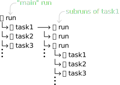

# the_bureaucrat

A package to help organizing data and results in a directory structure, cross platform and transparent.

# Installation

`pip install git+https://github.com/SengerM/the_bureaucrat`

# Usage

Simple usage example:

```python
from pathlib import Path
from the_bureaucrat.bureaucrats import RunBureaucrat

run_name = f'your_favourite_name'
Michael = RunBureaucrat(STORE_DATA_HERE_PATH/run_name)
Michael.create_run()

with Michael.handle_task('measure_thing') as Michaels_employee:
	with open(Michaels_employee.path_to_directory_of_my_task/'thing.txt', 'w') as ofile:
		print(f'The measured thing is equal to 1', file=ofile)
```

In the end this will create a directory for the run and within that directory as many subdirectories as tasks have been done. Also, each task will have a flag that will tell if it was completed successfully or if an error occurred, that can be checked later on, e.g.:

```python
if Michael.was_task_run_successfully('measure_thing'):
	print('`measure_thing` was successfull :)')
else:
	print('`measure_thing` was not successfull :(')
```

If for some reason some error occurs while `measure_thing` is ongoing, it will not pass unnoticed when you want to use that data in the future.

Furthermore, a backup of the python file in which the task was created will be automatically stored in the respective task directory. Then you can have a hint on how you did things in case you forget in the future.

For more examples, see [here](examples).

Live example on the cloud: [](https://mybinder.org/v2/gh/SengerM/the_bureaucrat/HEAD?labpath=examples%2FPyHEP%2FPyHEP.ipynb)

# Additional info

This package is thought to handle runs, each run can contain any number of tasks (each with a different name). Within each task anything can be stored, usually the results of such task e.g. the data from some measurement, some plots, etc. Each task can in turn contain subruns, which can contain tasks, and so. So it is a tree-like structure that is automatically created in the background.



An example that creates such tree-like structure is presented in [black_box](examples/black_box) within the [examples](examples) directory.
